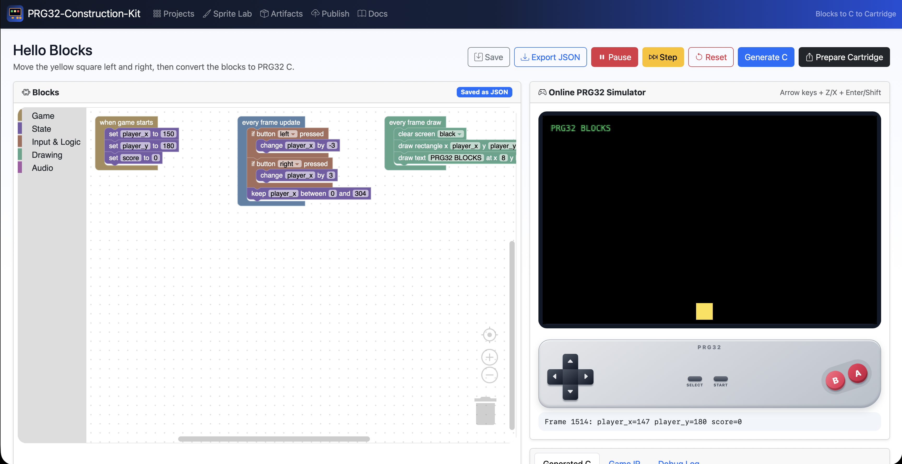

# PRG32-Construction-Kit

PRG32-Construction-Kit is a Flask, Bootstrap, jQuery, JavaScript, and Blockly progressive web application for classroom PRG32 game creation.




Students can:

- create Scratch-inspired block programs;
- save PRG32 block games as JSON;
- edit sprites and imported images in a browser pixel editor;
- play and debug games in an online JavaScript PRG32-like simulator;
- convert block programs to real PRG32-style C source;
- prepare Cartridge Store publishing bundles;
- publish bundles to a PRG32 Cartridge Store instance.

The app intentionally follows the same classroom-friendly shape as Cartridge Store: a small Flask service, installable PWA frontend, SQLite persistence, Docker support, `docs/` documentation, and simple HTTP APIs.

## Quick start with Python

```bash
python3 -m venv .venv
. .venv/bin/activate
pip install -r requirements.txt
python app.py
```

Open <http://127.0.0.1:5090/>.

Data is stored in `data/` by default. To move it:

```bash
export PRG32_KIT_DATA=/path/to/data
python app.py
```

## Quick start with Docker Compose

```bash
docker compose up --build
```

Open <http://127.0.0.1:5090/>.

The compose file mounts `./data` to `/data` inside the container.

## Optional PRG32 cartridge build toolchain

The app always generates C source. To produce real `.prg32` files, install the PRG32 Python build module/tooling in the runtime environment and make this command work:

```bash
python3 -m prg32 build --help
```

Override the build command when needed:

```bash
export PRG32_BUILD_COMMAND="python3 -m prg32 build"
```

Without the PRG32 toolchain, **Prepare Cartridge** still creates a source bundle containing generated C, project JSON, game IR JSON, manifest metadata, and build logs. With the toolchain, it also adds `.prg32` architecture artifacts to the Cartridge Store bundle.

## Repository layout

```text
app.py                         Flask entrypoint
prg32_construction_kit/        Flask app package, CRUD API, generator, packager, publisher
templates/                     Bootstrap/Jinja pages
static/                        PWA assets, JavaScript, CSS, Blockly integration
examples/                      Example Blocks JSON and sprite JSON
docs/                          Setup, API, architecture, Docker, tutorials, how-to guides
tests/                         pytest tests
.github/workflows/ci.yml       GitHub Actions CI
Dockerfile                     Container image
docker-compose.yml             Local persistent deployment
AGENT.md                       Formal development constraints
LICENSE                        MIT License
```

## Documentation

Start with:

- `docs/setup.md`
- `docs/docker.md`
- `docs/architecture.md`
- `docs/api.md`
- `docs/tutorials/01_first_project.md`

## License

MIT License. See `LICENSE`.
